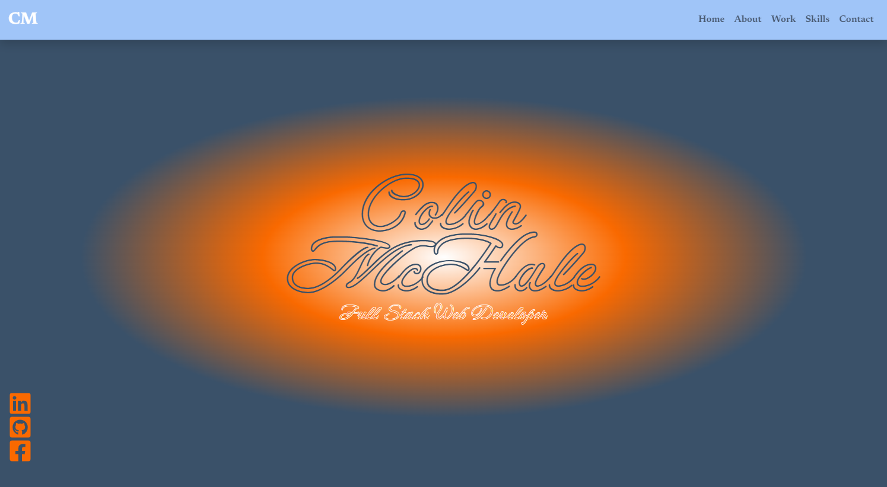
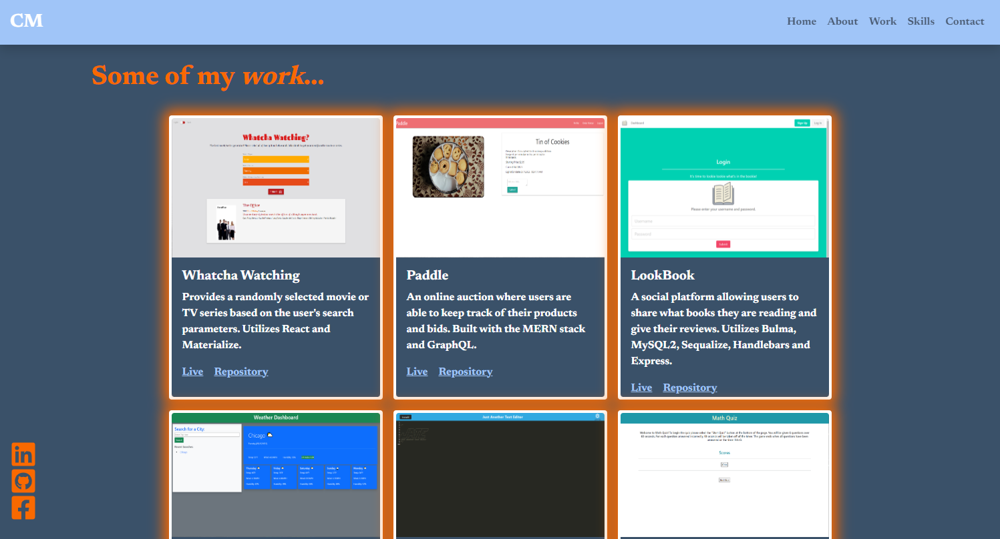
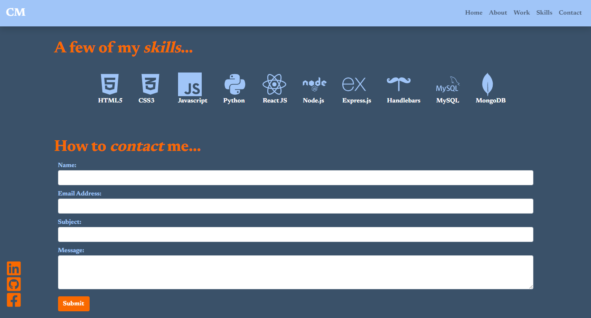

# React Portfolio

## Description  
My website portfolio was built to showcase my skills and recent projects I have completed. 
At the top of the page there is a nav bar with quick links to different sections of the website. The site also contains links to my social pages including LinkedIn, Github, And Facebook (icons are floating on the bottom left if wide screen, at the very bottom of the website if small screen). 
The first section of the site is a welcome page that includes my name and title in a bright, styled font. There are two different designs of the welcome section, one for wide screen and one for small screen. Following is a bio and picture for those to learn a little more about me. The next section is the project section which will include 6 projects with a screenshot and short description of the application (all containing links to the live application and repository) utilizing different coding languages. The final section is a contact form in which users will be able to fill out a few inputs such as name, email, subject, and a message that will be transformed into an email and sent directly to my personal email.

## Table of Contents  
[Description](#description)     
[Screenshots](#screenshots)  
[License](#license)  
[Tests](#tests)  
[Questions](#questions)  

## Screenshots 

[Link to Deployed Site](https://colinmchale.github.io/react-portfolio/)
Created using Javascript and React.

## License 
MPL 2.0
[Link to License](https://www.mozilla.org/en-US/MPL/2.0/)

## Tests  
Feel free to click on any of the links to repositories and applications to test that they work and the applications are running smoothly. Send me an email using the contact form and I will try to reply to as many as possible!

## Questions
Link to github: [Click Here](https://github.com/colinmchale)  
Please submit any additional questions you may have in an email to colin.mchale22@gmail.com
